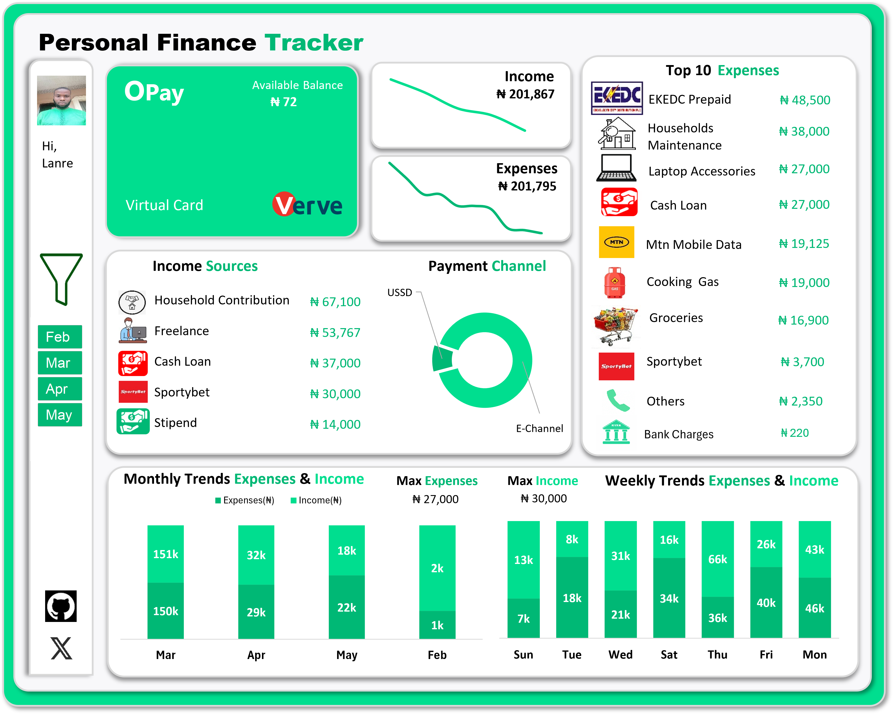

# Opay-Personal-Finance-Tracker- Feb - May 2025

This excel project  analyses my Opay transactions from Feb - May (2025) to track my  Finances

-----

## Problem Statement
I typical use my  Opay account for my day-to-day transactions,and most of this transactions are done virtually through my Opay app (E-Channel) or Ussd. 
From my daily expenses e.g buying of groceries,household expenses,mobile data etc. to different credit alert from different people.Hence ,the need to track and monitor my finances to know;
- What is my total income  Feb - May,
- What is my total expenses  Feb - May,
- what are the top expenses i made between this period (Feb - May),
- what are my major income sources,
- what is my income & expenses behaviour monthly & weekly?
--------------
## Data Source
 The Data source used for this project is my Opay Bank statement (pdf), downloaded directly from my Opay app from Feb - May 2025.
 
 
 
-----------------------
## Step-by-Step Procedure

The step-by-step procedure in analysing this dataset is as follows;
- Imported the downloaded Bank statement (pdf) into excel,which automatically loads into power Query 
- In power query,data is cleaned by selecting relevant tables,deleting irrelevant columns and standardization to relevant forms.
- Data is loaded back to excel workbook in a table format,where debit & credit are categorized into columns,
 and a seperate keyword table created to categories payment  descriptions using 'indexmatchisnumber)
- Pivot tables was inserted for further analysis, with pivot charts and slicers inserted
- Dashboard was designed using Opay branded color,  with Hex code ; #00DE8F,pivot charts ,icons & Slcers for interactivity

---------------------
## Dashboard Preview 
 

------------------------
## Key Findings 

------------------------
## Conclusion 

------------------------
## About Me

